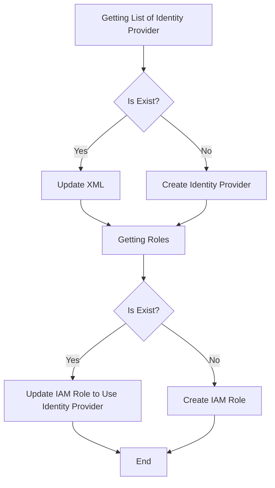

# AWS Integrator

Library to handle AWS SDK. Assuming the Policies is exists.

## Used Resources

- Identity Provider
- IAM Role

## Features

- Create Identity Provider
- Update Identity Provider
- Create IAM Role
- Update IAM Role

## Flows

## License

MIT