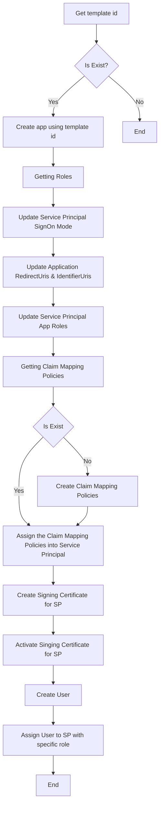

# Azure AD Integrator

Library to handle Microsoft Graph SDK.

## Used Resources

- ApplicationTemplates
- ServicePrincipals
  - AppRoleAssignments
  - AddTokenSigningCertificate
  - ClaimsMappingPolicies
- Applications
- Policies
  - ClaimsMappingPolicies

## Flows

## License

MIT