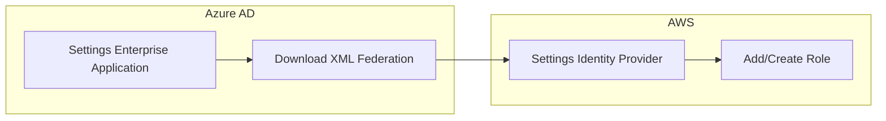
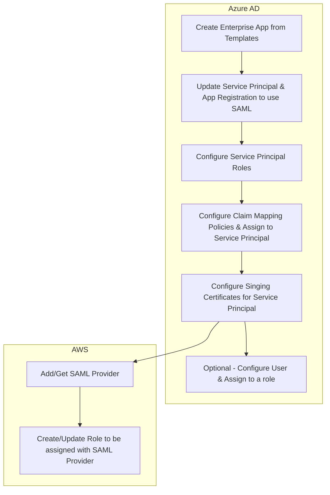
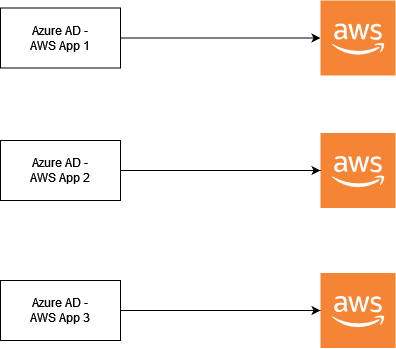
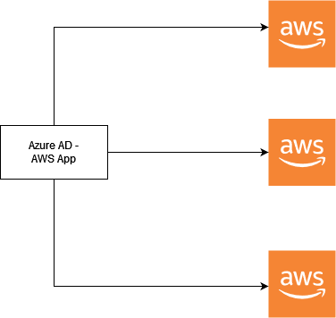

# Azure AD SSO Automate - AWS

## Flow

### General Flow

### Flow (Technical Terms)

## Resources

### Main Resources

#### Azure AD (AAD)

- [Tutorials/Documentations from Microsoft](https://learn.microsoft.com/en-us/graph/application-saml-sso-configure-api?tabs=csharp)
- Permissions `Application.ReadWrite.All`, `AppRoleAssignment.ReadWrite.All`, `Policy.Read.All`, `Policy.ReadWrite.ApplicationConfiguration`, and `User.ReadWrite.All`.
- [App List Dashboard](https://myapps.microsoft.com/)

#### AWS

- [Simple cross-platform application using the AWS SDK for .NET](https://docs.aws.amazon.com/sdk-for-net/v3/developer-guide/quick-start-s3-1-cross.html)
- [AmazonIdentityManagementServiceClient](https://docs.aws.amazon.com/sdkfornet/v3/apidocs/items/IAM/TIAMServiceClient.html)
- [AmazonIdentityManagementServiceClient.CreateSAMLProvider](https://docs.aws.amazon.com/sdkfornet/v3/apidocs/items/IAM/MIAMServiceCreateSAMLProviderCreateSAMLProviderRequest.html)
- [AmazonIdentityManagementServiceClient.AttachRolePolicy](https://docs.aws.amazon.com/sdkfornet/v3/apidocs/items/IAM/MIAMServiceAttachRolePolicyAttachRolePolicyRequest.html)
- [AmazonIdentityManagementServiceClient.CreatePolicy](https://docs.aws.amazon.com/sdkfornet/v3/apidocs/items/IAM/MIAMServiceCreatePolicyCreatePolicyRequest.html)

### Setup SSO Manually - Single Account

- https://learn.microsoft.com/en-us/azure/active-directory/saas-apps/amazon-web-service-tutorial

### Setup SSO Manually - Multiple Accounts

- https://learn.microsoft.com/en-us/azure/active-directory/saas-apps/aws-multi-accounts-tutorial

### Another Topic - Provisioning

- https://learn.microsoft.com/en-us/azure/active-directory/app-provisioning/application-provisioning-configuration-api

### Another Code Samples

- https://learn.microsoft.com/en-us/samples/azure-samples/ms-identity-dotnetcore-galleryapp-management/automate-saml-based-sso-app-configuration-using-ms-graph-api-sdk-net/

### Tools/SDK Documentation

- [Microsoft Graph Client](https://learn.microsoft.com/en-us/graph/sdks/create-client?tabs=CS)
- [Authentication Provider for MS Graph](https://learn.microsoft.com/en-us/graph/sdks/choose-authentication-providers?tabs=CS#client-credentials-provider)

## License

MIT